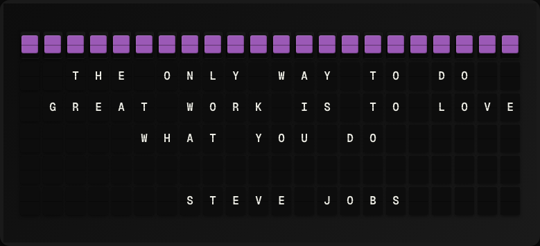

# Quote of the Day Plugin

Display a daily inspirational quote from ZenQuotes.



**→ [Setup Guide](./docs/SETUP.md)**

## Overview

The Quote of the Day plugin fetches a daily quote from the ZenQuotes API. The same quote is returned for the full day. No API key required; the free tier allows 1 request per second.

## Template Variables

| Variable | Description | Example |
|---|---|---|
| `quote_of_day.quote` | Full quote text | `Do it with passion` |
| `quote_of_day.author` | Quote author | `Rosa Parks` |

## Example Templates

```
QUOTE OF THE DAY

{{quote_of_day.quote}}

- {{quote_of_day.author}}

```

## Configuration

| Setting | Name | Description | Required |
|---|---|---|---|
| `refresh_seconds` | Refresh Interval | How often to fetch data (seconds) | No |

## Features

- ZenQuotes daily quote API
- New quote every day
- No API key required

## Author

FiestaBoard Team
